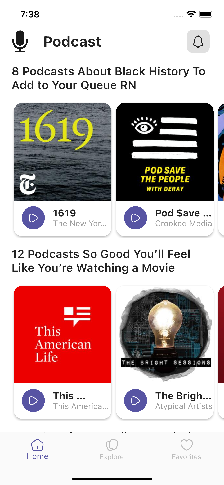
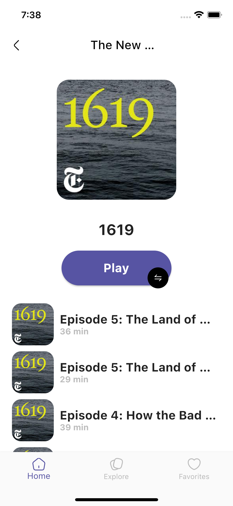
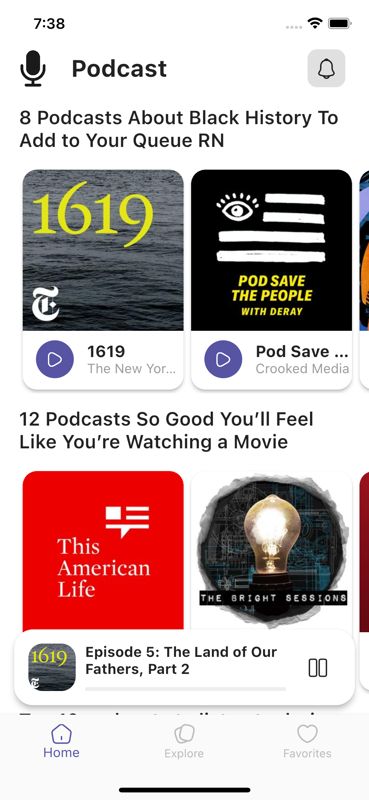
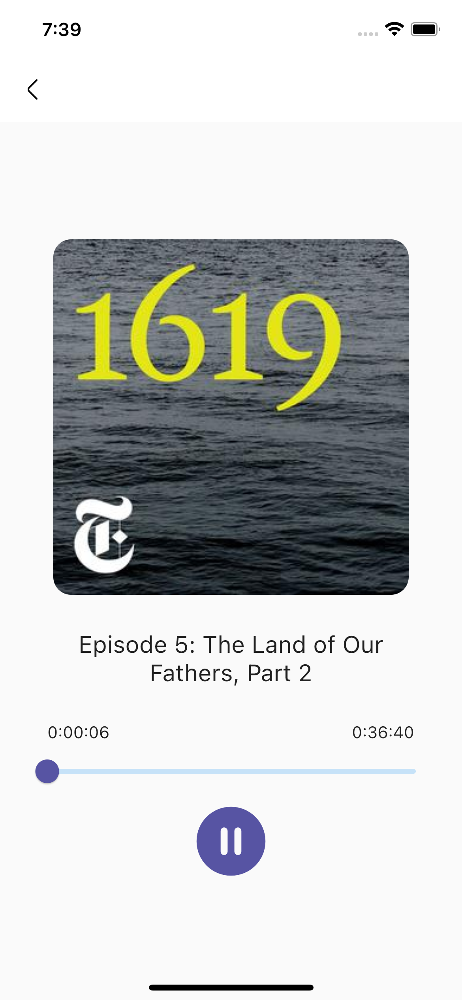

## Recipe App

Flutter Bloc Application with Clean Architecture

## Development Setup
Clone the repository and run the following commands:
```
flutter pub get
flutter run
```

## Screenshots

### App Pages
 

### Podcasts Pages
  

## Links
### Api
* [Listen Notes](https://www.listennotes.com/api/)
### Design
* [Sajon](https://dribbble.com/shots/17339237-Podcast-App-Design/attachments/12457393?mode=media)

